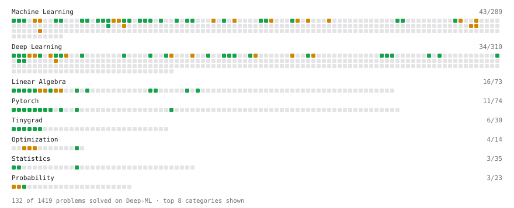

# Deep-ML

My machine learning practice from [Deep-ML](https://www.deep-ml.com). Every solution here was written by hand.

**265** solved · 211 problems · 13 labs · 41 math

[**Browse the interactive portfolio**](https://sumit1311singh.github.io/deep-ml/) to replay this filling in over time.

## Problems

| | Difficulty | Solved | |
| --- | --- | --- | --- |
| [Adagrad Optimizer](https://www.deep-ml.com/problems/145) | easy | 2026-04-16 | [solution](problems/0145-adagrad-optimizer) |
| [Adamax Optimizer](https://www.deep-ml.com/problems/148) | easy | 2026-09-06 | [solution](problems/0148-adamax-optimizer) |
| [Add a Bias Vector to a Batch via Broadcasting](https://www.deep-ml.com/problems/882) | easy | 2026-05-27 | [solution](problems/0882-add-a-bias-vector-to-a-batch-via-broadcasting) |
| [Add a Bias Vector to a Batch with Tinygrad Broadcasting](https://www.deep-ml.com/problems/891) | easy | 2026-05-27 | [solution](problems/0891-add-a-bias-vector-to-a-batch-with-tinygrad-broadcasting) |
| [Apply Zero Padding to an Image](https://www.deep-ml.com/problems/239) | easy | 2026-05-09 | [solution](problems/0239-apply-zero-padding-to-an-image) |
| [Backprop a Linear Layer by Hand](https://www.deep-ml.com/problems/898) | easy | 2026-05-27 | [solution](problems/0898-backprop-a-linear-layer-by-hand) |
| [Batch Iterator for Dataset](https://www.deep-ml.com/problems/30) | easy | 2026-04-05 | [solution](problems/0030-batch-iterator-for-dataset) |
| [Binary Classification with Logistic Regression](https://www.deep-ml.com/problems/104) | easy | 2026-04-26 | [solution](problems/0104-binary-classification-with-logistic-regression) |
| [Build a Linear Regression Model in Tinygrad](https://www.deep-ml.com/problems/894) | easy | 2026-05-27 | [solution](problems/0894-build-a-linear-regression-model-in-tinygrad) |
| [Build a Linear Regression Model with nn.Module](https://www.deep-ml.com/problems/885) | easy | 2026-05-26 | [solution](problems/0885-build-a-linear-regression-model-with-nn-module) |
| [Build an MLP with nn.Sequential](https://www.deep-ml.com/problems/887) | easy | 2026-05-27 | [solution](problems/0887-build-an-mlp-with-nn-sequential) |
| [Calculate 2x2 Matrix Inverse](https://www.deep-ml.com/problems/8) | easy | 2026-03-17 | [solution](problems/0008-calculate-2x2-matrix-inverse) |
| [Calculate Accuracy Score](https://www.deep-ml.com/problems/36) | easy | 2026-04-05 | [solution](problems/0036-calculate-accuracy-score) |
| [Calculate Conditional Probability from Data](https://www.deep-ml.com/problems/168) | easy | 2026-08-23 | [solution](problems/0168-calculate-conditional-probability-from-data) |
| [Calculate Cosine Similarity Between Vectors](https://www.deep-ml.com/problems/76) | easy | 2026-04-25 | [solution](problems/0076-calculate-cosine-similarity-between-vectors) |
| [Calculate Covariance Matrix](https://www.deep-ml.com/problems/10) | easy | 2026-03-17 | [solution](problems/0010-calculate-covariance-matrix) |
| [Calculate F1 Score from Predicted and True Labels](https://www.deep-ml.com/problems/91) | easy | 2026-05-01 | [solution](problems/0091-calculate-f1-score-from-predicted-and-true-labels) |
| [Calculate Jaccard Index for Binary Classification](https://www.deep-ml.com/problems/72) | easy | 2026-05-16 | [solution](problems/0072-calculate-jaccard-index-for-binary-classification) |
| [Calculate Mean Absolute Error (MAE)](https://www.deep-ml.com/problems/93) | easy | 2026-04-04 | [solution](problems/0093-calculate-mean-absolute-error-mae) |
| [Calculate Mean by Row or Column](https://www.deep-ml.com/problems/4) | easy | 2026-03-17 | [solution](problems/0004-calculate-mean-by-row-or-column) |
| [Calculate Number of Parameters in Neural Network](https://www.deep-ml.com/problems/371) | easy | 2026-05-18 | [solution](problems/0371-calculate-number-of-parameters-in-neural-network) |
| [Calculate Perplexity for Language Models](https://www.deep-ml.com/problems/320) | easy | 2026-06-07 | [solution](problems/0320-calculate-perplexity-for-language-models) |
| [Calculate R-squared for Regression Analysis](https://www.deep-ml.com/problems/69) | easy | 2026-05-13 | [solution](problems/0069-calculate-r-squared-for-regression-analysis) |
| [Calculate Root Mean Square Error (RMSE)](https://www.deep-ml.com/problems/71) | easy | 2026-04-02 | [solution](problems/0071-calculate-root-mean-square-error-rmse) |
| [Calculate SVM Margin Width](https://www.deep-ml.com/problems/282) | easy | 2026-05-15 | [solution](problems/0282-calculate-svm-margin-width) |
| [Check Linear Independence of Vectors](https://www.deep-ml.com/problems/331) | easy | 2026-08-22 | [solution](problems/0331-check-linear-independence-of-vectors) |
| [Compute a Gradient with PyTorch Autograd](https://www.deep-ml.com/problems/884) | easy | 2026-05-27 | [solution](problems/0884-compute-a-gradient-with-pytorch-autograd) |
| [Compute a Gradient with Tinygrad Autograd](https://www.deep-ml.com/problems/893) | easy | 2026-05-27 | [solution](problems/0893-compute-a-gradient-with-tinygrad-autograd) |
| [Compute Multi-class Cross-Entropy Loss](https://www.deep-ml.com/problems/134) | easy | 2026-04-10 | [solution](problems/0134-compute-multi-class-cross-entropy-loss) |
| [Compute Posterior Probability using Bayes' Theorem](https://www.deep-ml.com/problems/336) | easy | 2026-08-23 | [solution](problems/0336-compute-posterior-probability-using-bayes-theorem) |
| [Compute the Cross Product of Two 3D Vectors](https://www.deep-ml.com/problems/118) | easy | 2026-08-24 | [solution](problems/0118-compute-the-cross-product-of-two-3d-vectors) |
| [Convert Vector to Diagonal Matrix](https://www.deep-ml.com/problems/35) | easy | 2026-04-05 | [solution](problems/0035-convert-vector-to-diagonal-matrix) |
| [Cosine LR Schedule with Linear Warmup](https://www.deep-ml.com/problems/910) | easy | 2026-05-31 | [solution](problems/0910-cosine-lr-schedule-with-linear-warmup) |
| [Count Parameters of a Sequential Model](https://www.deep-ml.com/problems/1218) | easy | 2026-09-18 | [solution](problems/1218-count-parameters-of-a-sequential-model) |
| [Create a Float Tensor from a Python List](https://www.deep-ml.com/problems/880) | easy | 2026-05-27 | [solution](problems/0880-create-a-float-tensor-from-a-python-list) |
| [Create a Float Tensor with Tinygrad](https://www.deep-ml.com/problems/889) | easy | 2026-05-26 | [solution](problems/0889-create-a-float-tensor-with-tinygrad) |
| [Demonstrate Law of Large Numbers with Sampling](https://www.deep-ml.com/problems/342) | easy | 2026-08-23 | [solution](problems/0342-demonstrate-law-of-large-numbers-with-sampling) |
| [Derivative of a Polynomial](https://www.deep-ml.com/problems/116) | easy | 2026-03-16 | [solution](problems/0116-derivative-of-a-polynomial) |
| [Derivatives of Activation Functions](https://www.deep-ml.com/problems/217) | easy | 2026-04-08 | [solution](problems/0217-derivatives-of-activation-functions) |
| [Descriptive Statistics Calculator](https://www.deep-ml.com/problems/78) | easy | 2026-05-12 | [solution](problems/0078-descriptive-statistics-calculator) |
| [Detect Overfitting or Underfitting](https://www.deep-ml.com/problems/86) | easy | 2026-06-01 | [solution](problems/0086-detect-overfitting-or-underfitting) |
| [Dot Product Calculator](https://www.deep-ml.com/problems/83) | easy | 2026-04-25 | [solution](problems/0083-dot-product-calculator) |
| [Early Stopping with Patience](https://www.deep-ml.com/problems/913) | easy | 2026-05-31 | [solution](problems/0913-early-stopping-with-patience) |
| [Empirical Probability Mass Function (PMF)](https://www.deep-ml.com/problems/184) | easy | 2026-08-22 | [solution](problems/0184-empirical-probability-mass-function-pmf) |
| [Expected Value and Variance of an n-Sided Die](https://www.deep-ml.com/problems/179) | easy | 2026-08-22 | [solution](problems/0179-expected-value-and-variance-of-an-n-sided-die) |
| [Exponential Distribution PDF and CDF](https://www.deep-ml.com/problems/340) | easy | 2026-04-26 | [solution](problems/0340-exponential-distribution-pdf-and-cdf) |
| [ExponentialLR Learning Rate Scheduler](https://www.deep-ml.com/problems/154) | easy | 2026-04-21 | [solution](problems/0154-exponentiallr-learning-rate-scheduler) |
| [Feature Scaling Implementation](https://www.deep-ml.com/problems/16) | easy | 2026-03-20 | [solution](problems/0016-feature-scaling-implementation) |
| [GeLU Activation Function ](https://www.deep-ml.com/problems/147) | easy | 2026-04-08 | [solution](problems/0147-gelu-activation-function) |
| [Generate a Confusion Matrix for Binary Classification](https://www.deep-ml.com/problems/75) | easy | 2026-04-27 | [solution](problems/0075-generate-a-confusion-matrix-for-binary-classification) |
| [Gradient Checkpointing](https://www.deep-ml.com/problems/188) | easy | 2026-04-12 | [solution](problems/0188-gradient-checkpointing) |
| [Gradient Direction and Magnitude](https://www.deep-ml.com/problems/308) | easy | 2026-03-22 | [solution](problems/0308-gradient-direction-and-magnitude) |
| [Implement 2D Average Pooling](https://www.deep-ml.com/problems/265) | easy | 2026-05-02 | [solution](problems/0265-implement-2d-average-pooling) |
| [Implement a Linear Layer Forward Pass in Tinygrad](https://www.deep-ml.com/problems/892) | easy | 2026-05-27 | [solution](problems/0892-implement-a-linear-layer-forward-pass-in-tinygrad) |
| [Implement a Linear Layer Forward Pass with Matrix Multiplication](https://www.deep-ml.com/problems/883) | easy | 2026-05-27 | [solution](problems/0883-implement-a-linear-layer-forward-pass-with-matrix-multiplication) |
| [Implement Binary Cross-Entropy Loss](https://www.deep-ml.com/problems/263) | easy | 2026-04-10 | [solution](problems/0263-implement-binary-cross-entropy-loss) |
| [Implement Dropout from Scratch](https://www.deep-ml.com/problems/901) | easy | 2026-05-27 | [solution](problems/0901-implement-dropout-from-scratch) |
| [Implement Early Stopping Based on Validation Loss](https://www.deep-ml.com/problems/135) | easy | 2026-05-19 | [solution](problems/0135-implement-early-stopping-based-on-validation-loss) |
| [Implement F-Score Calculation for Binary Classification](https://www.deep-ml.com/problems/61) | easy | 2026-05-01 | [solution](problems/0061-implement-f-score-calculation-for-binary-classification) |
| [Implement Gini Impurity Calculation for a Set of Classes](https://www.deep-ml.com/problems/64) | easy | 2026-05-31 | [solution](problems/0064-implement-gini-impurity-calculation-for-a-set-of-classes) |
| [Implement Global Average Pooling](https://www.deep-ml.com/problems/114) | easy | 2026-04-30 | [solution](problems/0114-implement-global-average-pooling) |
| [Implement Gradient Clipping by Value](https://www.deep-ml.com/problems/292) | easy | 2026-04-27 | [solution](problems/0292-implement-gradient-clipping-by-value) |
| [Implement Hard Voting Classifier](https://www.deep-ml.com/problems/305) | easy | 2026-06-01 | [solution](problems/0305-implement-hard-voting-classifier) |
| [Implement He Weight Initialization](https://www.deep-ml.com/problems/290) | easy | 2026-04-28 | [solution](problems/0290-implement-he-weight-initialization) |
| [Implement Hinge Loss for SVM](https://www.deep-ml.com/problems/283) | easy | 2026-04-10 | [solution](problems/0283-implement-hinge-loss-for-svm) |
| [Implement LayerNorm from Scratch](https://www.deep-ml.com/problems/908) | easy | 2026-05-31 | [solution](problems/0908-implement-layernorm-from-scratch) |
| [Implement Orthogonal Projection of a Vector onto a Line](https://www.deep-ml.com/problems/66) | easy | 2026-06-16 | [solution](problems/0066-implement-orthogonal-projection-of-a-vector-onto-a-line) |
| [Implement Precision Metric](https://www.deep-ml.com/problems/46) | easy | 2026-04-27 | [solution](problems/0046-implement-precision-metric) |
| [Implement Recall Metric in Binary Classification](https://www.deep-ml.com/problems/52) | easy | 2026-04-17 | [solution](problems/0052-implement-recall-metric-in-binary-classification) |
| [Implement ReLU Activation Function](https://www.deep-ml.com/problems/42) | easy | 2026-03-21 | [solution](problems/0042-implement-relu-activation-function) |
| [Implement ReLU and Leaky ReLU](https://www.deep-ml.com/problems/1226) | easy | 2026-09-13 | [solution](problems/1226-implement-relu-and-leaky-relu) |
| [Implement Ridge Regression Loss Function](https://www.deep-ml.com/problems/43) | easy | 2026-04-04 | [solution](problems/0043-implement-ridge-regression-loss-function) |
| [Implement RMSNorm (Root Mean Square Layer Normalization)](https://www.deep-ml.com/problems/372) | easy | 2026-04-20 | [solution](problems/0372-implement-rmsnorm-root-mean-square-layer-normalization) |
| [Implement SwiGLU activation function](https://www.deep-ml.com/problems/156) | easy | 2026-06-15 | [solution](problems/0156-implement-swiglu-activation-function) |
| [Implement the ELU Activation Function](https://www.deep-ml.com/problems/97) | easy | 2026-04-06 | [solution](problems/0097-implement-the-elu-activation-function) |
| [Implement the Hard Sigmoid Activation Function](https://www.deep-ml.com/problems/96) | easy | 2026-06-14 | [solution](problems/0096-implement-the-hard-sigmoid-activation-function) |
| [Implement the Hardtanh Activation Function](https://www.deep-ml.com/problems/266) | easy | 2026-06-05 | [solution](problems/0266-implement-the-hardtanh-activation-function) |
| [Implement the Mish Activation Function](https://www.deep-ml.com/problems/262) | easy | 2026-06-03 | [solution](problems/0262-implement-the-mish-activation-function) |
| [Implement the SELU Activation Function](https://www.deep-ml.com/problems/103) | easy | 2026-05-06 | [solution](problems/0103-implement-the-selu-activation-function) |
| [Implement the Softplus Activation Function](https://www.deep-ml.com/problems/99) | easy | 2026-06-09 | [solution](problems/0099-implement-the-softplus-activation-function) |
| [Implement the Softsign Activation Function](https://www.deep-ml.com/problems/100) | easy | 2026-06-11 | [solution](problems/0100-implement-the-softsign-activation-function) |
| [Implement the Square ReLU Activation Function](https://www.deep-ml.com/problems/373) | easy | 2026-06-04 | [solution](problems/0373-implement-the-square-relu-activation-function) |
| [Implement the Swish Activation Function](https://www.deep-ml.com/problems/102) | easy | 2026-06-10 | [solution](problems/0102-implement-the-swish-activation-function) |
| [Implement the Tanh Activation Function](https://www.deep-ml.com/problems/264) | easy | 2026-05-04 | [solution](problems/0264-implement-the-tanh-activation-function) |
| [Implement Triplet Loss](https://www.deep-ml.com/problems/916) | easy | 2026-06-12 | [solution](problems/0916-implement-triplet-loss) |
| [Implement Weight Decay as L2 Regularization](https://www.deep-ml.com/problems/198) | easy | 2026-04-19 | [solution](problems/0198-implement-weight-decay-as-l2-regularization) |
| [Implement Xavier/Glorot Weight Initialization](https://www.deep-ml.com/problems/369) | easy | 2026-04-28 | [solution](problems/0369-implement-xavier-glorot-weight-initialization) |
| [Implementation of Log Softmax Function](https://www.deep-ml.com/problems/39) | easy | 2026-04-05 | [solution](problems/0039-implementation-of-log-softmax-function) |
| [KL Divergence Between Two Normal Distributions](https://www.deep-ml.com/problems/56) | easy | 2026-04-11 | [solution](problems/0056-kl-divergence-between-two-normal-distributions) |
| [L2 Normalization Along an Axis](https://www.deep-ml.com/problems/1022) | easy | 2026-08-24 | [solution](problems/1022-l2-normalization-along-an-axis) |
| [Label Encoding for Ordinal Variables](https://www.deep-ml.com/problems/356) | easy | 2026-05-17 | [solution](problems/0356-label-encoding-for-ordinal-variables) |
| [Leaky ReLU Activation Function](https://www.deep-ml.com/problems/44) | easy | 2026-04-01 | [solution](problems/0044-leaky-relu-activation-function) |
| [Learning Rate Range Finder for Linear Regression](https://www.deep-ml.com/problems/990) | easy | 2026-05-23 | [solution](problems/0990-learning-rate-range-finder-for-linear-regression) |
| [Linear Kernel Function](https://www.deep-ml.com/problems/45) | easy | 2026-04-05 | [solution](problems/0045-linear-kernel-function) |
| [Linear Learning Rate Decay](https://www.deep-ml.com/problems/377) | easy | 2026-05-18 | [solution](problems/0377-linear-learning-rate-decay) |
| [Linear Regression Using Gradient Descent](https://www.deep-ml.com/problems/15) | easy | 2026-03-19 | [solution](problems/0015-linear-regression-using-gradient-descent) |
| [Linear Regression Using Normal Equation](https://www.deep-ml.com/problems/14) | easy | 2026-03-18 | [solution](problems/0014-linear-regression-using-normal-equation) |
| [Matrix Determinant & Trace](https://www.deep-ml.com/problems/195) | easy | 2026-04-06 | [solution](problems/0195-matrix-determinant-trace) |
| [Matrix-Vector Dot Product](https://www.deep-ml.com/problems/1) | easy | 2026-03-16 | [solution](problems/0001-matrix-vector-dot-product) |
| [Mean Squared Error from Scratch](https://www.deep-ml.com/problems/1228) | easy | 2026-09-13 | [solution](problems/1228-mean-squared-error-from-scratch) |
| [Min-Max Scaling of Feature Values](https://www.deep-ml.com/problems/112) | easy | 2026-04-26 | [solution](problems/0112-min-max-scaling-of-feature-values) |
| [Momentum Optimizer](https://www.deep-ml.com/problems/146) | easy | 2026-04-18 | [solution](problems/0146-momentum-optimizer) |
| [Nesterov Accelerated Gradient Optimizer](https://www.deep-ml.com/problems/150) | easy | 2026-04-18 | [solution](problems/0150-nesterov-accelerated-gradient-optimizer) |
| [One SGD Update Step](https://www.deep-ml.com/problems/1234) | easy | 2026-09-14 | [solution](problems/1234-one-sgd-update-step) |
| [One-Hot Encoding of Nominal Values](https://www.deep-ml.com/problems/34) | easy | 2026-04-03 | [solution](problems/0034-one-hot-encoding-of-nominal-values) |
| [Pairwise Cosine Similarity Matrix](https://www.deep-ml.com/problems/1072) | easy | 2026-08-24 | [solution](problems/1072-pairwise-cosine-similarity-matrix) |
| [Poisson Distribution Probability Calculator](https://www.deep-ml.com/problems/81) | easy | 2026-05-12 | [solution](problems/0081-poisson-distribution-probability-calculator) |
| [Random Shuffle of Dataset](https://www.deep-ml.com/problems/29) | easy | 2026-04-05 | [solution](problems/0029-random-shuffle-of-dataset) |
| [Random Train/Validation/Test Split with Shuffling](https://www.deep-ml.com/problems/1058) | easy | 2026-08-30 | [solution](problems/1058-random-train-validation-test-split-with-shuffling) |
| [Reshape and Transpose a Tensor](https://www.deep-ml.com/problems/881) | easy | 2026-05-27 | [solution](problems/0881-reshape-and-transpose-a-tensor) |
| [Reshape and Transpose a Tinygrad Tensor](https://www.deep-ml.com/problems/890) | easy | 2026-05-27 | [solution](problems/0890-reshape-and-transpose-a-tinygrad-tensor) |
| [Reshape Matrix](https://www.deep-ml.com/problems/3) | easy | 2026-03-17 | [solution](problems/0003-reshape-matrix) |
| [Run One Training Step: Forward, Loss, Backward, Optimizer](https://www.deep-ml.com/problems/886) | easy | 2026-05-27 | [solution](problems/0886-run-one-training-step-forward-loss-backward-optimizer) |
| [Sampling Distribution of the Mean](https://www.deep-ml.com/problems/181) | easy | 2026-09-06 | [solution](problems/0181-sampling-distribution-of-the-mean) |
| [Save and Load Model Weights with state_dict](https://www.deep-ml.com/problems/888) | easy | 2026-06-06 | [solution](problems/0888-save-and-load-model-weights-with-state-dict) |
| [Scalar Multiplication of a Matrix](https://www.deep-ml.com/problems/5) | easy | 2026-03-17 | [solution](problems/0005-scalar-multiplication-of-a-matrix) |
| [Sigmoid Activation Function Understanding](https://www.deep-ml.com/problems/22) | easy | 2026-03-19 | [solution](problems/0022-sigmoid-activation-function-understanding) |
| [Single Linear Neuron Forward](https://www.deep-ml.com/problems/1224) | easy | 2026-09-13 | [solution](problems/1224-single-linear-neuron-forward) |
| [Single Neuron](https://www.deep-ml.com/problems/24) | easy | 2026-03-23 | [solution](problems/0024-single-neuron) |
| [Softmax Activation Function Implementation ](https://www.deep-ml.com/problems/23) | easy | 2026-03-19 | [solution](problems/0023-softmax-activation-function-implementation) |
| [StepLR Learning Rate Scheduler](https://www.deep-ml.com/problems/153) | easy | 2026-04-21 | [solution](problems/0153-steplr-learning-rate-scheduler) |
| [Tinygrad: Implement LayerNorm from Scratch](https://www.deep-ml.com/problems/929) | easy | 2026-06-08 | [solution](problems/0929-tinygrad-implement-layernorm-from-scratch) |
| [Transformation Matrix from Basis B to C](https://www.deep-ml.com/problems/27) | easy | 2026-03-27 | [solution](problems/0027-transformation-matrix-from-basis-b-to-c) |
| [Transpose of a Matrix](https://www.deep-ml.com/problems/2) | easy | 2026-03-17 | [solution](problems/0002-transpose-of-a-matrix) |
| [Vector Element-wise Sum](https://www.deep-ml.com/problems/121) | easy | 2026-06-13 | [solution](problems/0121-vector-element-wise-sum) |
| [Vector Norms (L1/L2/L-inf) and the Frobenius Norm](https://www.deep-ml.com/problems/328) | easy | 2026-04-06 | [solution](problems/0328-vector-norms-l1-l2-l-inf-and-the-frobenius-norm) |
| [Adam Optimizer](https://www.deep-ml.com/problems/87) | medium | 2026-09-14 | [solution](problems/0087-adam-optimizer) |
| [Bernoulli Naive Bayes Classifier](https://www.deep-ml.com/problems/140) | medium | 2026-09-19 | [solution](problems/0140-bernoulli-naive-bayes-classifier) |
| [Bias-Variance Decomposition from Bootstrap](https://www.deep-ml.com/problems/804) | medium | 2026-09-06 | [solution](problems/0804-bias-variance-decomposition-from-bootstrap) |
| [Binary Cross-Entropy from Logits](https://www.deep-ml.com/problems/1229) | medium | 2026-09-13 | [solution](problems/1229-binary-cross-entropy-from-logits) |
| [Binomial Distribution Probability](https://www.deep-ml.com/problems/79) | medium | 2026-05-12 | [solution](problems/0079-binomial-distribution-probability) |
| [Calculate Correlation Matrix](https://www.deep-ml.com/problems/37) | medium | 2026-08-22 | [solution](problems/0037-calculate-correlation-matrix) |
| [Calculate Eigenvalues of a Matrix](https://www.deep-ml.com/problems/6) | medium | 2026-03-23 | [solution](problems/0006-calculate-eigenvalues-of-a-matrix) |
| [Calculate Explained Variance Ratio for PCA](https://www.deep-ml.com/problems/350) | medium | 2026-05-29 | [solution](problems/0350-calculate-explained-variance-ratio-for-pca) |
| [Calculate KL Divergence Between Two Multivariate Gaussian Distributions](https://www.deep-ml.com/problems/136) | medium | 2026-08-29 | [solution](problems/0136-calculate-kl-divergence-between-two-multivariate-gaussian-distributions) |
| [Central Limit Theorem Simulation](https://www.deep-ml.com/problems/182) | medium | 2026-08-23 | [solution](problems/0182-central-limit-theorem-simulation) |
| [Chain Rule for Composite Functions](https://www.deep-ml.com/problems/214) | medium | 2026-04-06 | [solution](problems/0214-chain-rule-for-composite-functions) |
| [Check if Matrix is Positive Definite](https://www.deep-ml.com/problems/332) | medium | 2026-08-25 | [solution](problems/0332-check-if-matrix-is-positive-definite) |
| [Classify Critical Points Using Hessian Eigenvalues](https://www.deep-ml.com/problems/311) | medium | 2026-08-26 | [solution](problems/0311-classify-critical-points-using-hessian-eigenvalues) |
| [Compute the Hessian Matrix](https://www.deep-ml.com/problems/218) | medium | 2026-04-07 | [solution](problems/0218-compute-the-hessian-matrix) |
| [Compute the Null Space (Kernel) of a Matrix](https://www.deep-ml.com/problems/330) | medium | 2026-08-30 | [solution](problems/0330-compute-the-null-space-kernel-of-a-matrix) |
| [Conditional Probability from Joint Distribution](https://www.deep-ml.com/problems/180) | medium | 2026-08-23 | [solution](problems/0180-conditional-probability-from-joint-distribution) |
| [Contrastive Loss (InfoNCE / SimCLR-style)](https://www.deep-ml.com/problems/384) | medium | 2026-05-05 | [solution](problems/0384-contrastive-loss-infonce-simclr-style) |
| [CosineAnnealingLR Learning Rate Scheduler](https://www.deep-ml.com/problems/155) | medium | 2026-04-21 | [solution](problems/0155-cosineannealinglr-learning-rate-scheduler) |
| [Derivative of Cross-Entropy Loss w.r.t. Logits](https://www.deep-ml.com/problems/220) | medium | 2026-04-09 | [solution](problems/0220-derivative-of-cross-entropy-loss-w-r-t-logits) |
| [Derivative of Softmax](https://www.deep-ml.com/problems/219) | medium | 2026-04-09 | [solution](problems/0219-derivative-of-softmax) |
| [Dropout Layer](https://www.deep-ml.com/problems/151) | medium | 2026-04-24 | [solution](problems/0151-dropout-layer) |
| [Dummy Classifier Baseline](https://www.deep-ml.com/problems/847) | medium | 2026-08-30 | [solution](problems/0847-dummy-classifier-baseline) |
| [Dummy Regressor Baseline](https://www.deep-ml.com/problems/848) | medium | 2026-08-30 | [solution](problems/0848-dummy-regressor-baseline) |
| [Elastic Net Regression via Gradient Descent](https://www.deep-ml.com/problems/139) | medium | 2026-05-23 | [solution](problems/0139-elastic-net-regression-via-gradient-descent) |
| [Entropy & Cross-Entropy](https://www.deep-ml.com/problems/205) | medium | 2026-04-14 | [solution](problems/0205-entropy-cross-entropy) |
| [Epsilon-Insensitive Loss for SVM Regression](https://www.deep-ml.com/problems/813) | medium | 2026-05-23 | [solution](problems/0813-epsilon-insensitive-loss-for-svm-regression) |
| [Find the Best Gini-Based Split for a Binary Decision Tree](https://www.deep-ml.com/problems/138) | medium | 2026-05-31 | [solution](problems/0138-find-the-best-gini-based-split-for-a-binary-decision-tree) |
| [Find the column space of a matrix](https://www.deep-ml.com/problems/68) | medium | 2026-08-30 | [solution](problems/0068-find-the-column-space-of-a-matrix) |
| [Gaussian Elimination for Solving Linear Systems](https://www.deep-ml.com/problems/58) | medium | 2026-08-22 | [solution](problems/0058-gaussian-elimination-for-solving-linear-systems) |
| [Gaussian Naive Bayes Classifier](https://www.deep-ml.com/problems/261) | medium | 2026-06-02 | [solution](problems/0261-gaussian-naive-bayes-classifier) |
| [Gradient Clipping by Global Norm](https://www.deep-ml.com/problems/197) | medium | 2026-05-20 | [solution](problems/0197-gradient-clipping-by-global-norm) |
| [Implement Adam Optimization Algorithm](https://www.deep-ml.com/problems/49) | medium | 2026-04-23 | [solution](problems/0049-implement-adam-optimization-algorithm) |
| [Implement AdamW Optimizer Step](https://www.deep-ml.com/problems/169) | medium | 2026-09-14 | [solution](problems/0169-implement-adamw-optimizer-step) |
| [Implement Batch Normalization for BCHW Input](https://www.deep-ml.com/problems/115) | medium | 2026-04-24 | [solution](problems/0115-implement-batch-normalization-for-bchw-input) |
| [Implement BatchNorm2d from Scratch (training mode)](https://www.deep-ml.com/problems/902) | medium | 2026-05-30 | [solution](problems/0902-implement-batchnorm2d-from-scratch-training-mode) |
| [Implement Cosine Annealing with Warm Restarts](https://www.deep-ml.com/problems/392) | medium | 2026-04-22 | [solution](problems/0392-implement-cosine-annealing-with-warm-restarts) |
| [Implement Focal Loss for Imbalanced Classification](https://www.deep-ml.com/problems/255) | medium | 2026-04-19 | [solution](problems/0255-implement-focal-loss-for-imbalanced-classification) |
| [Implement Gradient Descent Variants with MSE Loss](https://www.deep-ml.com/problems/47) | medium | 2026-04-15 | [solution](problems/0047-implement-gradient-descent-variants-with-mse-loss) |
| [Implement Grid Search](https://www.deep-ml.com/problems/288) | medium | 2026-06-01 | [solution](problems/0288-implement-grid-search) |
| [Implement Group Normalization](https://www.deep-ml.com/problems/126) | medium | 2026-04-25 | [solution](problems/0126-implement-group-normalization) |
| [Implement K-Fold Cross-Validation](https://www.deep-ml.com/problems/18) | medium | 2026-05-22 | [solution](problems/0018-implement-k-fold-cross-validation) |
| [Implement K-Nearest Neighbors](https://www.deep-ml.com/problems/173) | medium | 2026-09-05 | [solution](problems/0173-implement-k-nearest-neighbors) |
| [Implement Label Smoothing for Multi-Class Cross-Entropy](https://www.deep-ml.com/problems/194) | medium | 2026-05-21 | [solution](problems/0194-implement-label-smoothing-for-multi-class-cross-entropy) |
| [Implement Lasso Regression using ISTA](https://www.deep-ml.com/problems/50) | medium | 2026-05-14 | [solution](problems/0050-implement-lasso-regression-using-ista) |
| [Implement Layer Normalization for Sequence Data](https://www.deep-ml.com/problems/109) | medium | 2026-04-25 | [solution](problems/0109-implement-layer-normalization-for-sequence-data) |
| [Implement Random Forest Feature Importance](https://www.deep-ml.com/problems/343) | medium | 2026-06-02 | [solution](problems/0343-implement-random-forest-feature-importance) |
| [Implement Reduced Row Echelon Form (RREF) Function](https://www.deep-ml.com/problems/48) | medium | 2026-08-30 | [solution](problems/0048-implement-reduced-row-echelon-form-rref-function) |
| [Implement RMSProp Optimizer](https://www.deep-ml.com/problems/200) | medium | 2026-03-24 | [solution](problems/0200-implement-rmsprop-optimizer) |
| [Implement Soft Voting Classifier](https://www.deep-ml.com/problems/306) | medium | 2026-06-01 | [solution](problems/0306-implement-soft-voting-classifier) |
| [Implement Stratified K-Fold Cross-Validation](https://www.deep-ml.com/problems/840) | medium | 2026-09-20 | [solution](problems/0840-implement-stratified-k-fold-cross-validation) |
| [Implement the Huber Loss Function](https://www.deep-ml.com/problems/192) | medium | 2026-05-18 | [solution](problems/0192-implement-the-huber-loss-function) |
| [Implementing Basic Autograd Operations](https://www.deep-ml.com/problems/26) | medium | 2026-03-31 | [solution](problems/0026-implementing-basic-autograd-operations) |
| [Jacobian Matrix Calculation](https://www.deep-ml.com/problems/202) | medium | 2026-04-07 | [solution](problems/0202-jacobian-matrix-calculation) |
| [Learning Curve Generator for Bias-Variance Diagnosis](https://www.deep-ml.com/problems/800) | medium | 2026-09-06 | [solution](problems/0800-learning-curve-generator-for-bias-variance-diagnosis) |
| [LU Decomposition of a Square Matrix](https://www.deep-ml.com/problems/333) | medium | 2026-08-29 | [solution](problems/0333-lu-decomposition-of-a-square-matrix) |
| [Matrix Rank](https://www.deep-ml.com/problems/329) | medium | 2026-08-22 | [solution](problems/0329-matrix-rank) |
| [Matrix times Matrix ](https://www.deep-ml.com/problems/9) | medium | 2026-03-23 | [solution](problems/0009-matrix-times-matrix) |
| [Matrix Transformation ](https://www.deep-ml.com/problems/7) | medium | 2026-03-23 | [solution](problems/0007-matrix-transformation) |
| [Maximum A Posteriori (MAP) Estimation for Bernoulli Parameter](https://www.deep-ml.com/problems/338) | medium | 2026-08-29 | [solution](problems/0338-maximum-a-posteriori-map-estimation-for-bernoulli-parameter) |
| [Maximum Likelihood Estimation for Gaussian Distribution](https://www.deep-ml.com/problems/337) | medium | 2026-08-29 | [solution](problems/0337-maximum-likelihood-estimation-for-gaussian-distribution) |
| [Mini-Batch Gradient Descent Step for Linear Regression](https://www.deep-ml.com/problems/803) | medium | 2026-05-23 | [solution](problems/0803-mini-batch-gradient-descent-step-for-linear-regression) |
| [Normal Distribution PDF Calculator](https://www.deep-ml.com/problems/80) | medium | 2026-05-12 | [solution](problems/0080-normal-distribution-pdf-calculator) |
| [Numerical Gradient Checking](https://www.deep-ml.com/problems/313) | medium | 2026-04-13 | [solution](problems/0313-numerical-gradient-checking) |
| [Numerically Stable Softmax](https://www.deep-ml.com/problems/1227) | medium | 2026-09-13 | [solution](problems/1227-numerically-stable-softmax) |
| [One Adam Update Step](https://www.deep-ml.com/problems/1236) | medium | 2026-09-14 | [solution](problems/1236-one-adam-update-step) |
| [One Training Step](https://www.deep-ml.com/problems/1219) | medium | 2026-09-14 | [solution](problems/1219-one-training-step) |
| [Overlapping Max Pooling](https://www.deep-ml.com/problems/190) | medium | 2026-05-03 | [solution](problems/0190-overlapping-max-pooling) |
| [Partial Derivatives of Multivariable Functions](https://www.deep-ml.com/problems/215) | medium | 2026-03-26 | [solution](problems/0215-partial-derivatives-of-multivariable-functions) |
| [Polynomial Regression Fit](https://www.deep-ml.com/problems/801) | medium | 2026-09-05 | [solution](problems/0801-polynomial-regression-fit) |
| [Precision and Recall at Threshold](https://www.deep-ml.com/problems/849) | medium | 2026-09-01 | [solution](problems/0849-precision-and-recall-at-threshold) |
| [Principal Component Analysis (PCA) Implementation](https://www.deep-ml.com/problems/19) | medium | 2026-05-28 | [solution](problems/0019-principal-component-analysis-pca-implementation) |
| [Product Rule for Derivatives](https://www.deep-ml.com/problems/309) | medium | 2026-03-25 | [solution](problems/0309-product-rule-for-derivatives) |
| [Quotient Rule for Derivatives](https://www.deep-ml.com/problems/312) | medium | 2026-03-25 | [solution](problems/0312-quotient-rule-for-derivatives) |
| [SGD with Momentum Step](https://www.deep-ml.com/problems/1235) | medium | 2026-09-14 | [solution](problems/1235-sgd-with-momentum-step) |
| [Simple Convolutional 2D Layer](https://www.deep-ml.com/problems/41) | medium | 2026-05-11 | [solution](problems/0041-simple-convolutional-2d-layer) |
| [Single Neuron with Backpropagation](https://www.deep-ml.com/problems/25) | medium | 2026-03-29 | [solution](problems/0025-single-neuron-with-backpropagation) |
| [Solve Linear Equations using Jacobi Method](https://www.deep-ml.com/problems/11) | medium | 2026-03-28 | [solution](problems/0011-solve-linear-equations-using-jacobi-method) |
| [StandardScaler Fit and Transform](https://www.deep-ml.com/problems/842) | medium | 2026-08-30 | [solution](problems/0842-standardscaler-fit-and-transform) |
| [Stochastic Gradient Descent Step for Linear Regression](https://www.deep-ml.com/problems/802) | medium | 2026-05-23 | [solution](problems/0802-stochastic-gradient-descent-step-for-linear-regression) |
| [Two-Layer MLP Forward Pass](https://www.deep-ml.com/problems/1225) | medium | 2026-09-13 | [solution](problems/1225-two-layer-mlp-forward-pass) |
| [Warmup + Cosine Decay Schedule](https://www.deep-ml.com/problems/196) | medium | 2026-04-21 | [solution](problems/0196-warmup-cosine-decay-schedule) |
| [Decision Tree Learning](https://www.deep-ml.com/problems/20) | hard | 2026-05-31 | [solution](problems/0020-decision-tree-learning) |
| [QR Decomposition](https://www.deep-ml.com/problems/201) | hard | 2026-08-23 | [solution](problems/0201-qr-decomposition) |
| [Train Logistic Regression with Gradient Descent](https://www.deep-ml.com/problems/106) | hard | 2026-09-05 | [solution](problems/0106-train-logistic-regression-with-gradient-descent) |
| [Train Softmax Regression with Gradient Descent](https://www.deep-ml.com/problems/105) | hard | 2026-09-20 | [solution](problems/0105-train-softmax-regression-with-gradient-descent) |

## Labs

| | Difficulty | Solved | |
| --- | --- | --- | --- |
| [Design Your Own Activation Function](https://www.deep-ml.com/labs/9) | easy | 2026-05-16 | [solution](labs/0009-design-your-own-activation-function) |
| [Design Your Own Normalization Layer](https://www.deep-ml.com/labs/24) | easy | 2026-09-19 | [solution](labs/0024-design-your-own-normalization-layer) |
| [Dimensionality Reduction with Sklearn](https://www.deep-ml.com/labs/15) | easy | 2026-09-21 | [solution](labs/0015-dimensionality-reduction-with-sklearn) |
| [Fix Overfitting with Regularization (Sklearn)](https://www.deep-ml.com/labs/22) | easy | 2026-09-20 | [solution](labs/0022-fix-overfitting-with-regularization-sklearn) |
| [PyTorch: Build a Complete Training Loop](https://www.deep-ml.com/labs/13) | easy | 2026-09-18 | [solution](labs/0013-pytorch-build-a-complete-training-loop) |
| [PyTorch: Build a Complete Training Loop](https://www.deep-ml.com/labs/17) | easy | 2026-05-16 | [solution](labs/0017-pytorch-build-a-complete-training-loop) |
| [Split the Data Honestly and Beat a Baseline](https://www.deep-ml.com/labs/3d26c3f9-cb73-4ab1-bc4d-86cfab2af6d1) | easy | 2026-09-01 | [solution](labs/3d26c3f9-cb73-4ab1-bc4d-86cfab2af6d1-split-the-data-honestly-and-beat-a-baseline) |
| [Train a Binary Classifier](https://www.deep-ml.com/labs/23) | easy | 2026-05-26 | [solution](labs/0023-train-a-binary-classifier) |
| [Train a Linear Regression Model](https://www.deep-ml.com/labs/18) | easy | 2026-05-26 | [solution](labs/0018-train-a-linear-regression-model) |
| [Data Preprocessing: Handling Missing Values](https://www.deep-ml.com/labs/11) | medium | 2026-09-02 | [solution](labs/0011-data-preprocessing-handling-missing-values) |
| [Design Your Own Optimizer (NumPy)](https://www.deep-ml.com/labs/8) | medium | 2026-09-14 | [solution](labs/0008-design-your-own-optimizer-numpy) |
| [Fix Overfitting with Regularization (NumPy)](https://www.deep-ml.com/labs/21) | medium | 2026-09-07 | [solution](labs/0021-fix-overfitting-with-regularization-numpy) |
| [PyTorch: Implement Your Own Gradient Descent Training Step](https://www.deep-ml.com/labs/12) | medium | 2026-09-18 | [solution](labs/0012-pytorch-implement-your-own-gradient-descent-training-step) |

## Math

| | Difficulty | Solved | |
| --- | --- | --- | --- |
| [Derivatives and Gradients](https://www.deep-ml.com/math-problems/1) | easy | 2026-09-18 | [solution](math/0001-derivatives-and-gradients) |
| [Descriptive Statistics](https://www.deep-ml.com/math-problems/18) | easy | 2026-08-21 | [solution](math/0018-descriptive-statistics) |
| [Expectation and Variance Algebra](https://www.deep-ml.com/math-problems/33) | easy | 2026-08-22 | [solution](math/0033-expectation-and-variance-algebra) |
| [Gradient Descent Updates](https://www.deep-ml.com/math-problems/5) | easy | 2026-08-21 | [solution](math/0005-gradient-descent-updates) |
| [Matrix Basics](https://www.deep-ml.com/math-problems/9) | easy | 2026-08-21 | [solution](math/0009-matrix-basics) |
| [ML Workflow Basics](https://www.deep-ml.com/math-problems/30) | easy | 2026-08-30 | [solution](math/0030-ml-workflow-basics) |
| [Model Selection: CV, AIC, and BIC](https://www.deep-ml.com/math-problems/43) | easy | 2026-09-05 | [solution](math/0043-model-selection-cv-aic-and-bic) |
| [Probability Fundamentals](https://www.deep-ml.com/math-problems/19) | easy | 2026-08-22 | [solution](math/0019-probability-fundamentals) |
| [Vector Operations](https://www.deep-ml.com/math-problems/7) | easy | 2026-08-21 | [solution](math/0007-vector-operations) |
| [Backpropagation and the Chain Rule](https://www.deep-ml.com/math-problems/4) | medium | 2026-08-22 | [solution](math/0004-backpropagation-and-the-chain-rule) |
| [Bayes' Theorem](https://www.deep-ml.com/math-problems/20) | medium | 2026-08-22 | [solution](math/0020-bayes-theorem) |
| [Bias–Variance Decomposition](https://www.deep-ml.com/math-problems/39) | medium | 2026-09-05 | [solution](math/0039-bias-variance-decomposition) |
| [Common Distributions I: Bernoulli, Binomial, Uniform](https://www.deep-ml.com/math-problems/21) | medium | 2026-08-22 | [solution](math/0021-common-distributions-i-bernoulli-binomial-uniform) |
| [Common Distributions II: Normal, Poisson, Exponential](https://www.deep-ml.com/math-problems/22) | medium | 2026-08-22 | [solution](math/0022-common-distributions-ii-normal-poisson-exponential) |
| [Covariance and Correlation](https://www.deep-ml.com/math-problems/17) | medium | 2026-08-22 | [solution](math/0017-covariance-and-correlation) |
| [Determinants and Trace](https://www.deep-ml.com/math-problems/11) | medium | 2026-08-22 | [solution](math/0011-determinants-and-trace) |
| [Gram–Schmidt and Orthonormal Bases](https://www.deep-ml.com/math-problems/47) | medium | 2026-08-28 | [solution](math/0047-gram-schmidt-and-orthonormal-bases) |
| [Information Theory: Entropy](https://www.deep-ml.com/math-problems/24) | medium | 2026-08-27 | [solution](math/0024-information-theory-entropy) |
| [Inverse and Rank](https://www.deep-ml.com/math-problems/12) | medium | 2026-08-22 | [solution](math/0012-inverse-and-rank) |
| [Law of Large Numbers and Central Limit Theorem](https://www.deep-ml.com/math-problems/23) | medium | 2026-08-23 | [solution](math/0023-law-of-large-numbers-and-central-limit-theorem) |
| [Least Squares and the Normal Equations](https://www.deep-ml.com/math-problems/34) | medium | 2026-08-22 | [solution](math/0034-least-squares-and-the-normal-equations) |
| [Log-Likelihood Gradients](https://www.deep-ml.com/math-problems/38) | medium | 2026-08-29 | [solution](math/0038-log-likelihood-gradients) |
| [Logistic Regression as Maximum Likelihood](https://www.deep-ml.com/math-problems/40) | medium | 2026-08-31 | [solution](math/0040-logistic-regression-as-maximum-likelihood) |
| [Margins and Soft-Margin SVMs](https://www.deep-ml.com/math-problems/42) | medium | 2026-09-19 | [solution](math/0042-margins-and-soft-margin-svms) |
| [Matrix Calculus Identities](https://www.deep-ml.com/math-problems/35) | medium | 2026-08-22 | [solution](math/0035-matrix-calculus-identities) |
| [Matrix Multiplication](https://www.deep-ml.com/math-problems/10) | medium | 2026-08-21 | [solution](math/0010-matrix-multiplication) |
| [Multivariate Calculus](https://www.deep-ml.com/math-problems/2) | medium | 2026-08-22 | [solution](math/0002-multivariate-calculus) |
| [Multivariate Gaussians](https://www.deep-ml.com/math-problems/36) | medium | 2026-08-23 | [solution](math/0036-multivariate-gaussians) |
| [Neural Network Derivatives](https://www.deep-ml.com/math-problems/3) | medium | 2026-08-22 | [solution](math/0003-neural-network-derivatives) |
| [Optimization: Convexity and Critical Points](https://www.deep-ml.com/math-problems/6) | medium | 2026-08-23 | [solution](math/0006-optimization-convexity-and-critical-points) |
| [Orthogonality and Projections](https://www.deep-ml.com/math-problems/14) | medium | 2026-08-22 | [solution](math/0014-orthogonality-and-projections) |
| [Regularization and Generalization](https://www.deep-ml.com/math-problems/31) | medium | 2026-08-23 | [solution](math/0031-regularization-and-generalization) |
| [Softmax and Cross-Entropy](https://www.deep-ml.com/math-problems/32) | medium | 2026-08-22 | [solution](math/0032-softmax-and-cross-entropy) |
| [Solving Linear Systems](https://www.deep-ml.com/math-problems/13) | medium | 2026-08-22 | [solution](math/0013-solving-linear-systems) |
| [Taylor Expansions and Local Quadratic Models](https://www.deep-ml.com/math-problems/37) | medium | 2026-08-23 | [solution](math/0037-taylor-expansions-and-local-quadratic-models) |
| [The Four Fundamental Subspaces](https://www.deep-ml.com/math-problems/46) | medium | 2026-08-24 | [solution](math/0046-the-four-fundamental-subspaces) |
| [Vector Norms and Linear Independence](https://www.deep-ml.com/math-problems/8) | medium | 2026-08-21 | [solution](math/0008-vector-norms-and-linear-independence) |
| [Eigendecomposition and SVD](https://www.deep-ml.com/math-problems/16) | hard | 2026-08-23 | [solution](math/0016-eigendecomposition-and-svd) |
| [KL Divergence](https://www.deep-ml.com/math-problems/25) | hard | 2026-08-29 | [solution](math/0025-kl-divergence) |
| [Matrix Decompositions: LU and QR](https://www.deep-ml.com/math-problems/15) | hard | 2026-08-23 | [solution](math/0015-matrix-decompositions-lu-and-qr) |
| [Maximum Likelihood and MAP](https://www.deep-ml.com/math-problems/26) | hard | 2026-08-29 | [solution](math/0026-maximum-likelihood-and-map) |

---

_This file is regenerated by Deep-ML on every push._
